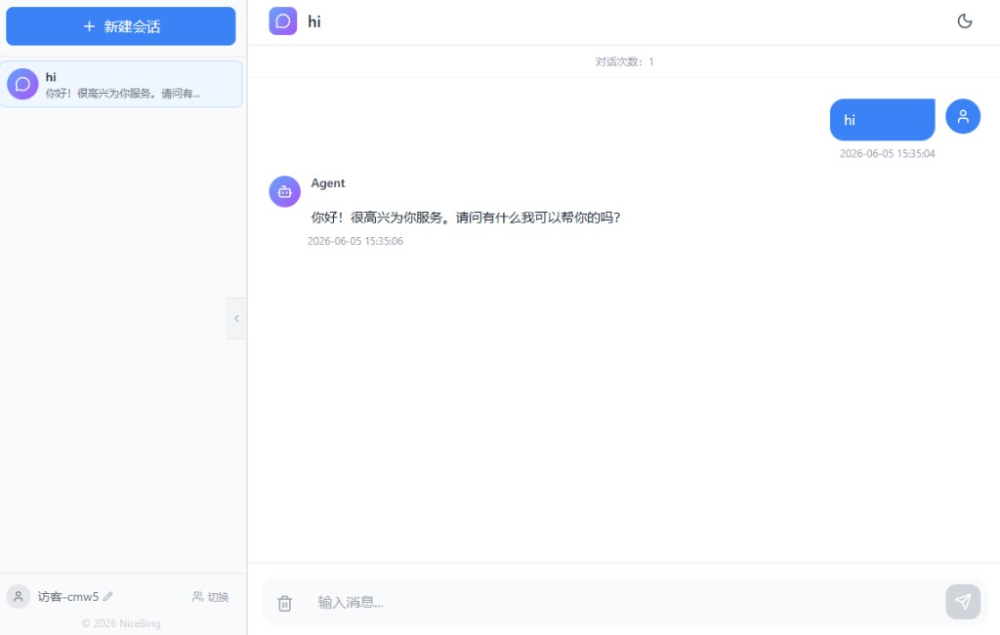

# AgentScope Chat API

基于 FastAPI + AgentScope + Vue 构建的大模型对话应用，支持 **ReAct 智能体**（思考-行动循环）、**工具调用**、**SSE 流式响应**和**会话记忆管理**。



## 功能特性

- **ReAct 智能体** — 自主思考-行动循环，根据问题自动决定是否调用工具
- **工具调用** — 内置计算器、日期工具、网络搜索等工具，模型可自主调用
- **SSE 流式输出** — 实时逐 token 返回，延迟低
- **会话记忆** — 基于 `session_id` 的多轮对话；本地 JSON 完整持久化，请求大模型时注入「早期摘要 + 最近 20 轮完整对话」
- **OpenAI 兼容格式** — 流式/非流式响应均遵循 OpenAI Chat Completions 格式
- **System Prompt** — 支持在请求中传入 system 消息
- **Token 用量统计** — 每轮返回 `usage` 信息
- **会话管理 API** — 查看、获取、删除会话
- **Web UI** — 基于 Vue 3 的聊天界面，支持实时流式消息展示

## 环境要求

- Python >= 3.12
- Node.js >= 18
- uv（推荐）或 pip
- 可访问 `cn.bing.com`（使用 WebSearchTool 时需要）

## 快速开始

### 1. 安装后端依赖

```bash
cd backend
uv sync
```

### 2. 配置环境变量

在 `backend` 目录下创建或编辑 `.env` 文件：

```env
LLM_API_KEY=your_api_key_here
LLM_BASE_URL=https://api.deepseek.com
LLM_MODEL=deepseek-v4-flash

# 和风天气（国内天气查询，注册：https://dev.qweather.com）
QWEATHER_API_HOST=your-api-host.qweatherapi.com
QWEATHER_API_KEY=your_qweather_api_key

# FastAPI 文档路径（留空则关闭对应页面，默认 /docs、/redoc、/openapi.json）
DOCS_URL=/docs
REDOC_URL=/redoc
OPENAPI_URL=/openapi.json

# 可选：聊天记录存储目录，默认为 backend/data/chat_memory
# MEMORY_DATA_DIR=./data/chat_memory

# 可选：请求大模型时注入的历史轮数上限（以 assistant 回复为一轮），默认 20；设为 0 则不注入历史
# MEMORY_ROUND_LIMIT=20

# 可选：是否对超出轮数上限的早期历史生成摘要并注入模型，默认开启
# MEMORY_SUMMARY_ENABLED=true
```

> 支持任意 OpenAI 兼容 API（OpenAI、Azure、硅基流动等），只需修改 `base_url` 和 `model_name`。
>
> 聊天记录与会话元数据持久化到本地 JSON 文件；Docker Compose 部署时已挂载卷 `chat_memory_data` 防止容器重启后丢失。
>
> `MEMORY_ROUND_LIMIT` 与 `MEMORY_SUMMARY_ENABLED` 仅影响发给大模型的上下文，不会截断或删除本地已保存的完整会话记录。

### 3. 配置 MCP 服务（可选）

后端启动时会自动读取 `backend/mcp.json` 中的 `mcpServers` 并注册 MCP 工具，无需再通过 `.env` 维护固定的 MCP URL。

```json
{
  "mcpServers": {
    "12306-mcp": {
      "type": "streamable_http",
      "url": "https://mcp.api-inference.modelscope.net/your-token/mcp",
      "headers": {}
    },
    "AI_Go_Hotel_MCP": {
      "type": "streamable_http",
      "url": "https://mcp.api-inference.modelscope.net/your-token/mcp"
    }
  }
}
```

当前支持 `streamable_http` 类型。每个服务可配置：

| 字段 | 必填 | 说明 |
|---|---|---|
| `type` | 是 | MCP 类型，目前支持 `streamable_http` |
| `url` | 是 | MCP 服务地址 |
| `name` | 否 | 注册到 AgentScope 的服务名，默认使用 `mcpServers` 的 key |
| `headers` | 否 | 请求 MCP 服务时附加的 HTTP headers |
| `server_kind` | 否 | 业务类型，影响工具参数归一化与结果格式化；未配置时会从服务名推断 `12306` / `hotel` |
| `execution_timeout` | 否 | 单次工具调用超时时间，默认 `120.0` 秒 |

### 4. 启动后端服务

```bash
cd backend
uv run uvicorn main:app --host 0.0.0.0 --port 8000 --reload
```

服务启动后访问 Swagger UI：http://localhost:8000/docs（路径由 `DOCS_URL` 控制，ReDoc 为 `REDOC_URL`）

### 5. 安装前端依赖

```bash
cd frontend
npm install
```

### 6. 启动前端开发服务器

```bash
cd frontend
npm run dev
```

前端启动后访问：http://localhost:5173

## Docker 部署

使用 Docker 可将前后端打包为**单一镜像**一键部署，容器内由 Nginx 提供前端静态资源并反向代理 API。

### 前置要求

- [Docker](https://docs.docker.com/get-docker/) >= 20.10
- [Docker Compose](https://docs.docker.com/compose/)（可选，推荐）

### 1. 配置环境变量

在 `backend/.env` 中配置大模型相关变量（与本地开发相同）：

```env
LLM_API_KEY=your_api_key_here
LLM_BASE_URL=https://api.deepseek.com
LLM_MODEL=deepseek-v4-flash

# 可选：文档路径（生产环境可留空关闭）
DOCS_URL=/docs
REDOC_URL=/redoc
OPENAPI_URL=/openapi.json
```

### 2. 使用 Docker Compose 启动（推荐）

```bash
docker compose up -d --build
```

默认映射端口为 **8081**，可在项目根目录 `.env` 中通过 `APP_PORT` 修改：

```env
APP_PORT=8081
```

启动后访问：

| 地址 | 说明 |
|---|---|
| http://localhost:8000 | Web 聊天界面 |
| http://localhost:8000/docs | Swagger API 文档（路径同 `DOCS_URL`，默认 `/docs`） |

若将文档路径改为 `/api/docs` 等以 `/api/` 开头的地址，Nginx 会通过现有 `/api/` 反代规则自动转发，无需额外配置；若改为其他路径，需同步修改 `docker/nginx.conf`。

常用命令：

```bash
docker compose logs -f    # 查看日志
docker compose down       # 停止并移除容器
docker compose up -d --build  # 代码变更后重新构建并启动
```

### 3. 手动构建与运行

```bash
# 构建镜像
docker build -t agentscope-chat:latest .

# 启动容器
docker run -d \
  -p 8081:80 \
  -e LLM_API_KEY=your_api_key_here \
  -e LLM_BASE_URL=https://api.deepseek.com \
  -e LLM_MODEL=deepseek-v4-flash \
  agentscope-chat:latest
```

### 镜像架构

```
浏览器 → Nginx :80
           ├── /           → Vue 前端静态文件
           ├── /api/*      → uvicorn :8000（SSE 流式代理；若 DOCS_URL 为 /api/docs 则文档也走此规则）
           └── /docs       → Swagger UI（默认 DOCS_URL=/docs 时由 Nginx 单独反代）
```

镜像采用多阶段构建：

1. **frontend-build** — Node.js 构建 Vue 前端
2. **backend-build** — uv 安装 Python 依赖
3. **最终镜像** — Nginx + FastAPI，约 350MB

### 国内网络说明

若构建时拉取 Docker Hub 镜像超时，可指定镜像加速源：

```bash
# 方式一：构建参数
docker build --build-arg DOCKER_REGISTRY=docker.1panel.live -t agentscope-chat:latest .

# 方式二：在项目根目录 .env 中设置（docker compose 自动读取）
DOCKER_REGISTRY=docker.1panel.live
```

可选加速源：`docker.m.daocloud.io`（默认）、`docker.1panel.live`

## 项目结构

```
.
├── backend/                    # 后端代码（FastAPI + AgentScope）
│   ├── main.py                # FastAPI 应用入口，路由定义
│   ├── mcp.json               # MCP 服务配置，启动时自动注册
│   ├── pyproject.toml         # 项目依赖配置
│   ├── .env                   # 环境变量（API Key 等，不提交）
│   ├── .python-version
│   └── uv.lock
│   │
│   ├── agents/
│   │   ├── __init__.py
│   │   └── react_agent.py     # ReAct 智能体，实现思考-行动循环
│   │
│   ├── schemas/
│   │   ├── __init__.py
│   │   ├── chat_request.py    # 聊天请求模型
│   │   ├── chat_message.py    # 聊天消息模型
│   │   └── user.py            # 用户名相关请求模型
│   │
│   ├── memory/
│   │   ├── __init__.py
│   │   ├── memory_manager.py  # 会话级记忆管理器（文件持久化 + 摘要 + 历史上限）
│   │   ├── history_summary.py # 早期历史摘要生成与拼接
│   │   └── file_backend.py    # 基于 JSON 文件的聊天记录存储
│   │
│   └── tools/
│       ├── __init__.py        # 工具注册表
│       ├── base_tool.py       # 工具基类
│       ├── calculator_tool.py # 计算器工具（数学运算）
│       ├── date_tool.py       # 日期工具（当前时间、格式化、加减、差值）
│       ├── web_search_tool.py # 网络搜索工具（必应中文搜索）
│       ├── weather_tool.py    # 国内天气查询（和风天气）
│       ├── qweather_client.py # 和风天气 API 客户端
│       ├── bing_client.py     # 必应搜索与网页抓取客户端
│       └── mcp/               # MCP 客户端加载、增强工具与结果格式化
│
├── frontend/                   # 前端代码（Vue 3 + Vite）
│   ├── src/
│   │   ├── components/
│   │   │   ├── Layout.vue     # 主布局组件
│   │   │   ├── Sidebar.vue    # 侧边栏（会话列表）
│   │   │   ├── ChatArea.vue   # 聊天区域
│   │   │   ├── MessageBubble.vue # 消息气泡
│   │   │   └── MarkdownRenderer.vue # Markdown 渲染组件
│   │   ├── services/
│   │   │   └── api.js         # API 服务封装
│   │   ├── App.vue
│   │   ├── main.js
│   │   └── style.css
│   ├── package.json
│   ├── vite.config.js
│   ├── tailwind.config.js
│   └── postcss.config.js
│
├── docker/                     # Docker 运行配置
│   ├── nginx.conf             # Nginx 反向代理与静态资源
│   └── start.sh               # 容器启动脚本（uvicorn + nginx）
├── Dockerfile                  # 多阶段镜像构建
├── docker-compose.yml          # Compose 编排
├── .dockerignore
├── .env.example                # 环境变量示例（APP_PORT、镜像加速等）
├── .gitignore
└── README.md
```

## 会话记忆

本项目采用**自研的会话级对话历史记忆**（非 AgentScope 内置 `InMemoryMemory`）：

| 维度 | 说明 |
|---|---|
| 存储方式 | 本地 JSON 文件（`backend/data/chat_memory/sessions/{session_id}.json`） |
| 作用范围 | 按 `session_id` 隔离；可选 `username` 绑定会话归属 |
| 写入策略 | 每轮对话结束后追加 user + assistant 消息，**完整保存，不截断** |
| 读取策略 | 前端/API 查询会话时返回**完整历史** |
| 模型上下文 | 超出 `MEMORY_ROUND_LIMIT` 的早期历史生成摘要注入；最近 N 轮以完整对话注入 |
| 摘要缓存 | 摘要持久化在会话 JSON 的 `history_summary` 字段，支持增量更新，避免每轮重复生成 |

一轮对话以 `assistant` 回复为边界；若同一轮包含连续多条 `user` 消息，会一并保留。

注入模型的消息顺序为：`[用户 system（如有）] → [早期对话摘要 system] → [最近 N 轮完整对话] → [本次新消息]`。

本地记录和前端展示始终保留完整历史；摘要生成失败时会降级为仅注入最近 N 轮完整对话。

## 接口说明

### POST /api/chat

智能体聊天接口。模型会自动判断是否需要调用工具来回答问题。

**请求体：**

| 字段 | 类型 | 默认值 | 说明 |
|---|---|---|---|
| `messages` | `list[ChatMessage]` | 必填 | 消息列表（前端通常只传当前用户消息） |
| `stream` | `bool` | `true` | 是否使用 SSE 流式响应 |
| `session_id` | `str` | `""` | 会话 ID，空则自动生成并返回 |
| `username` | `str` | `""` | 用户名，用于绑定会话归属 |

**ChatMessage 结构：**

| 字段 | 类型 | 说明 |
|---|---|---|
| `role` | `str` | 角色：`user` / `assistant` / `system` |
| `content` | `str` | 消息内容 |

### GET /api/tools

获取所有可用工具列表。

### POST /api/sessions

创建并绑定用户会话。

### GET /api/sessions

获取活跃会话列表（含消息数量），支持 `?username=` 过滤。

### GET /api/sessions/{session_id}

获取指定会话的详细信息（含完整对话历史）。

### GET /api/sessions/{session_id}/share

获取用于公开分享的会话（脱敏，不含用户名与 IP）。

### DELETE /api/sessions/{session_id}

软删除指定会话（数据文件保留，不再出现在列表中）。

### POST /api/users

注册用户名。

### GET /api/users

获取所有已注册用户名。

### GET /api/users/{username}/sessions

获取指定用户名下的会话列表。

### GET /

健康检查接口。

## 使用示例

### 流式聊天（默认）

```bash
curl -X POST http://localhost:8000/api/chat \
  -H "Content-Type: application/json" \
  -d '{
    "messages": [{"role": "user", "content": "你好"}]
  }'
```

新会话时响应头包含 `X-Session-Id`，用于后续请求。

### 工具调用示例

模型会自动识别需要调用工具的问题：

```bash
curl -X POST http://localhost:8000/api/chat \
  -H "Content-Type: application/json" \
  -d '{
    "messages": [{"role": "user", "content": "计算 2 + 3 * 4 等于多少？"}],
    "stream": false
  }'
```

模型会自主调用 `calculator` 工具并返回结果。

### 日期工具

```bash
curl -X POST http://localhost:8000/api/chat \
  -H "Content-Type: application/json" \
  -d '{
    "messages": [{"role": "user", "content": "今天是几号？"}],
    "stream": false
  }'
```

### 多轮对话

```bash
# 首次对话
SESSION=$(curl -s -X POST http://localhost:8000/api/chat \
  -H "Content-Type: application/json" \
  -d '{"messages": [{"role": "user", "content": "我叫张三"}], "stream": false}' \
  | python -c "import sys,json; print(json.load(sys.stdin)[\"session_id\"])")

# 后续对话
curl -X POST http://localhost:8000/api/chat \
  -H "Content-Type: application/json" \
  -d "{
    \"messages\": [{\"role\": \"user\", \"content\": \"我叫什么名字？\"}],
    \"session_id\": \"$SESSION\",
    \"stream\": false
  }"
```

### 携带 System Prompt

```bash
curl -X POST http://localhost:8000/api/chat \
  -H "Content-Type: application/json" \
  -d '{
    "messages": [
      {"role": "system", "content": "你是一个友好的中文助手，喜欢用简洁的方式回答问题。"},
      {"role": "user", "content": "介绍一下你自己"}
    ]
  }'
```

## 技术栈

### 后端
- [FastAPI](https://fastapi.tiangolo.com/) — Web 框架
- [AgentScope](https://github.com/modelscope/agentscope) — 模型封装（OpenAIChatModel）与 ReAct 智能体（`Agent` / `Toolkit`）
- [Uvicorn](https://www.uvicorn.org/) — ASGI 服务器
- [httpx](https://www.python-httpx.org/) — HTTP 客户端（必应搜索）
- [Beautiful Soup](https://www.crummy.com/software/BeautifulSoup/) — HTML 解析（搜索结果与网页抓取）

### 前端
- [Vue 3](https://vuejs.org/) — 前端框架
- [Vite](https://vitejs.dev/) — 构建工具
- [TailwindCSS 3](https://tailwindcss.com/) — CSS 框架
- [Lucide Icons](https://lucide.dev/) — 图标库
- [markdown-it](https://markdown-it.github.io/) — Markdown 渲染
- [highlight.js](https://highlightjs.org/) — 代码高亮

## 内置工具

| 工具 | 名称 | 说明 |
|---|---|---|
| 计算器 | `calculator` | 数学运算，支持加减乘除、幂运算、开方、三角函数等 |
| 日期工具 | `date_tool` | 获取当前时间、日期格式化、日期加减、日期差计算 |
| 天气查询 | `weather_tool` | 国内城市实时天气与逐日预报（和风天气 API） |
| 网络搜索 | `web_search` | 必应中文搜索，自动抓取 Top 结果正文，无需 API Key |
| 12306 MCP | `get-tickets` 等 | 火车票/车次/车站查询（在 `backend/mcp.json` 配置） |
| 酒店 MCP | `searchHotels` 等 | 全球酒店搜索、价格查询与预订（在 `backend/mcp.json` 配置） |

## 扩展建议

- **分布式存储**：将 `FileBackend` 替换为 Redis 或数据库，支持多实例部署共享会话
- **自定义工具**：继承 `BaseTool` 实现 `execute` 方法，并在 `tools/__init__.py` 中注册
- **鉴权**：在 `/api/chat` 端点前添加 API Key 校验中间件
- **按 token 裁剪**：在 `build_messages_with_history` 中按 token 数而非固定轮数截断历史
